# RStudio & GitHub

This is a very simple tutorial that allows you to configure RStudio and obtain
code from GitHub - it is not a comprehensive Git tutorial.

## 1. Install

- Git from [git-scm.com](https://git-scm.com/downloads)
- R from [CRAN](https://cran.r-project.org/)
- RStudio IDE desktop from [RStudio](https://www.rstudio.com/products/rstudio/download)
  + it is OK to install other packages required by RStudio

#### Checks

- RStudio IDE > Options > General should display the R version used
- RStudio IDE > Options > Git/SVN should identify the **Git executable**

#### Optional tools

- if on Windows, [RTools](https://cran.r-project.org/bin/windows/Rtools/)
- if on Windows or OSX and making extensive use of git, [SourceTree](https://www.sourcetreeapp.com/)

## 2. Configure Remote Repository 

#### GitHub

- Create your own GitHub account
  + optionally, enable 2FA and test logging in

## 3. Setup Keys

**Note:** If you are already familiar with RSA Keys and have generated your key,
you may skip these steps

#### RStudio IDE > Options > Git/SVN  > Create RSA Key

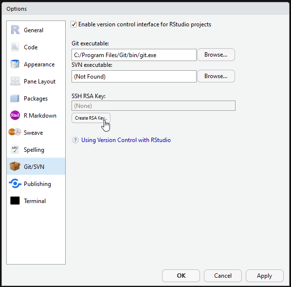

Do not generate a new key if RStudio finds one!

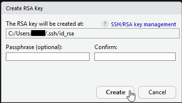

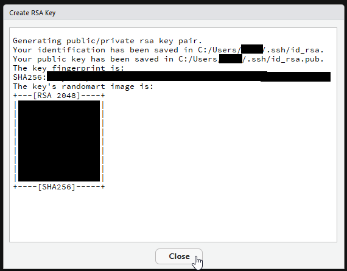

Note the location (folder) of the files and the name of the files (id_rsa). 
There are two keys / files: the public one (`id_rsa.pub`) is OK to share. 
The private key (`id_rsa`) should always be kept private.

## 4. Add Public Key to GitHub

#### RStudio IDE > Options > Git/SVN > View Public Key

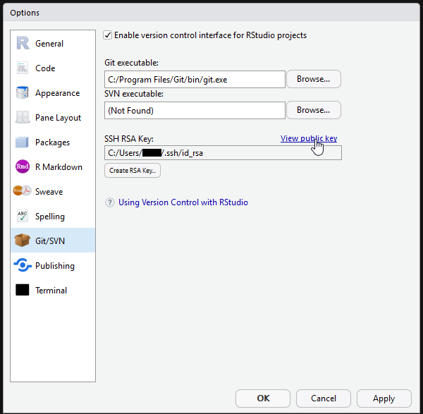

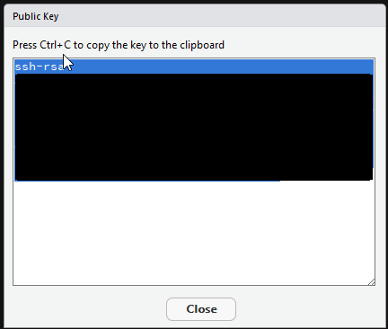

Copy the Public Key to the Clipboard

#### Go to: GitHub > Settings > SSH and GPG keys

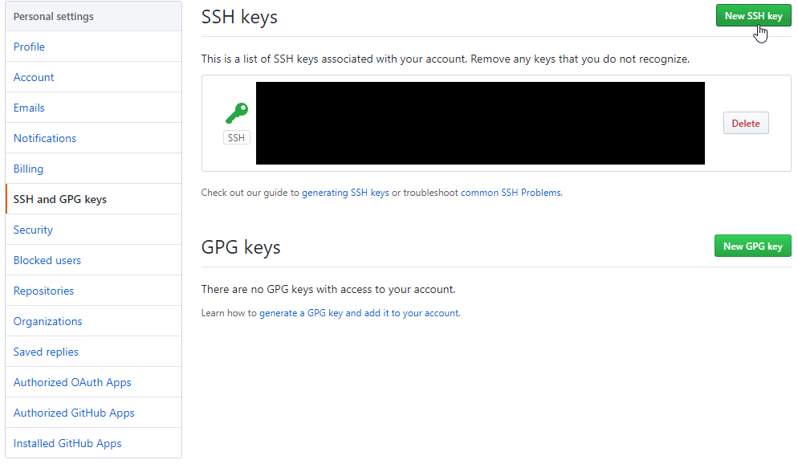

#### Add SSH Key to GitHub

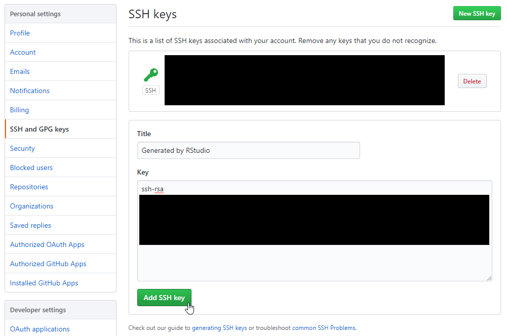

## 5. Clone RStudio Project

#### RStudio IDE > File > New Project ... > Version Control > Git 

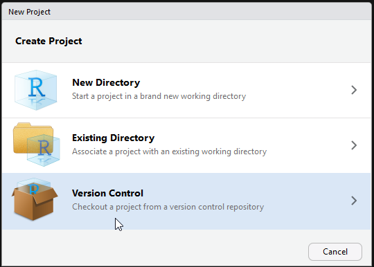

Select Git, it should look like this:

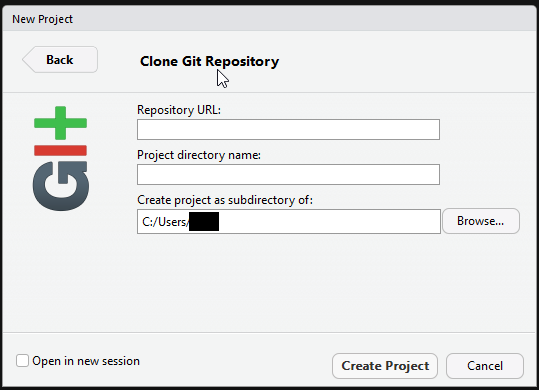

#### Go to: GitHub > project repository > get link

Select "Clone with SSH" then copy to Clipboard the `git@github...` link.

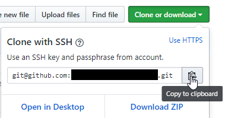

#### Copy and Paste the link into RStudio dialog box

The Project directory name should be populated automatically. 
You should select the parent folder. 

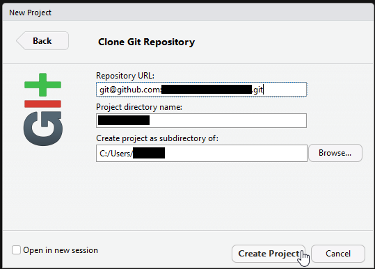

#### Press [Create Project]

If the RSA keys are not configured correctly, you will see an error message.
`Permission denied (publickey)`

If successful, RStudio will open the new project and in the **Files** panel
you will see the project files. This is your *local repository*.

You will also see a **Git** panel 
(empty at the beginning) where you can pull, commit and push code changes.

## 6. Update your local files

If you want to keep your *local repository* up to date, you need to **Pull**
code from the *remote repository (GitHub)*.

#### RStudio IDE > Git panel > press **Pull**

Please notice that on the top-right side the Git panel display the "branch",
in this case `master`.

**Note:** If you just want to view new code using Pull should be sufficient.
If you make any changes you should discard them before using Pull. 

**For making changes, merging and pushing please see a more advanced 
Git tutorial.**
